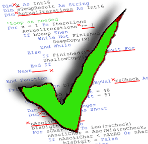

<!-- https://softwareengineering.stackexchange.com/questions/165763/is-a-coding-standard-even-needed-any-more -->

Coding standards aren't as emphasized in teachings for newly budding coders. However, starting as early as possible and building strong coding practices can help save lots of time and efficiency in young coders' careers down the line. My experience with ESLint with IntelliJ has saved me lots of time when rereading written code and understanding colleague's work.

## What are coding standards?

Codings tandards are rules and guidelines set up to follow. These guidelines can include naming styles, use of special words, line count restrictions, etc. The goal of coding standards is to set up cleaner coding. These rules aren't concrete and can vary depending on the project at hand or the group you're working with. 

## Why we follow coding standards

The most important reason to follow coding standards is to make your written code readable and easy-to-understand. Having simple and easy-to-read code is important for many reasons. If you're working in a group, it's integral that your groupmates can look at your contributions and easily follow. On the opposite hand, you'd want to be able to quickly look at your partners' code and understand what is being done. Different practices could cause misunderstandings and deciphering code will take up time that could have been used for work---wasting company's time.

Coding standards are also important when you're working on an independent project. You want your code to be easy-to-understand because coming back to a project you haven't touched in a large span of time can become unnecessarily more difficult than it has to be when you can't understand your own code. Taking that extra step and extra few moments following your own coding standards can save hours of time down the road.

## Ideal coding standards to follow

Now that we understand what coding standards are and why we want to follow them, you can decide which coding standards are perfect for the project at hand. First thing to note when choosing coding standards is the programming language the project is written in. Different languages have different optimal coding practices. 

Rules that will greatly help include rules that help write as little as possible per line of code, use easy-to-understand naming conventions, as little nesting as possible, and having outlines for useful comments that can describe each function of a code, handling exceptions, etc. 

Overall, following guidelines when coding will help you in the long-run whether you're working on an independent project or working in a group.
