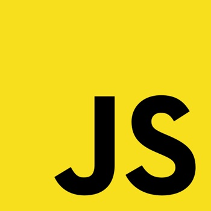

<!-- https://softwareengineering.stackexchange.com/questions/165763/is-a-coding-standard-even-needed-any-more -->

My first experience with JavaScript was through a Full-Stack Web Development course in a coding bootcamp—and since then it was love at first sight, and all personal projects I’ve worked on since then have been in JavaScript. Learning about the funny origin and flexibility of JavaScript has made JavaScript my favorite programming language to work with.

## JavaScript Origins

In the coding bootcamp we cover full-stack development with HTML, CSS, JavaScript, React, Ruby and Rails, Computer Science fundamentals, and programming skills. In the bootcamp I learned that JavaScript’s name was chosen as a way to ride on the success of Java at the time. I found it extremely hilarious that JavaScript has absolutely nothing to do with the Java programming language. 

As a child I learned very basic HTML and heavily enjoyed making and editing simple web pages. So, as a young avid HTML fan, learning JavaScript which was made as a ‘glue’ to HTML so web designers could easily assemble components such as images and plugins. Being able to use JavaScript to make HTML and CSS pages dynamic was very attractive to me.

## Accessible, Flexible, and Friendly

JavaScript is the language that can produce apps accessible to everyone and isn’t limited by what device a user’s using, needing to install an app, or update to the most recent application version. Since JavaScript can be combined with HTML and CSS it is one of the most popular ways of creating web applications. All you need is access to the internet to access web applications. Since it’s hosted on the web, users don’t need to install any app or worry about application versions and you can access the application from computers, mobile platforms, and basically any device that can access the world wide web. 

With the flexibility and accessibility of JavaScript it’s the programming language of choice I use when creating web applications. I’ve made web applications to aid in my Japanese language studying, games to play for competitions with friends, and many other small utility web applications.

## Revisiting the Language

There's a Japanese concept, *Shoshin*, that derives from Zen Buddhism and translates to “beginner’s mind.” It relates to being open and eager with no preconceptions when studying—even at an advanced level—as if you were learning about a topic from a beginner level. I always aim to enforce this concept everyday as I learn and study deeper into materials I enjoy studying: programming and Japanese language. 

Revisiting JavaScript in a classroom setting I was very excited to learn more about the language I’ve grown to love. While trying to think of Shoshin in mind I try to forget all habits I’ve learned and try to learn and adapt the material taught. I’ve come to learn about the difference with the “var” and “let” keywords and the dangers of accidentally overwriting variables when you use the “var” keyword. I always aim to declare all variables in the beginning of the code to prevent overwriting any variables, so until now I’ve used the “var” keyword when declaring variables in JavaScript. But I’m happy to learn of this important difference and will change my habits for a more efficient coding habit.
