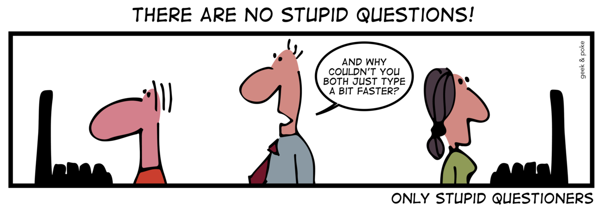

What does it mean to ask a smart question? What does it mean to ask a stupid question? Nobody's perfect when it comes to programming, or anything in life. We're always learning and we should have that mindset. Having said that, throughout our learning processes we're all going to be stumped at some point. There will be times we reach a wall blocking us from progressing. At those times you'll have (hopefully) exhausted all of your resources that you have access to on your own and have decided: I. Need. Help. There's nothing wrong with asking for help. After all, you're not expected to have all of the answers. But in order to get the answers you need, it's important to do everything in your power to help the person helping you. The best way to do that is to ask smart questions.

## Smart Questions

I studied Japanese in high school but nothing much came out of it after graduating. I decided to revisit the language and earnestly studied to take the world-wide Japanese Language Proficiency Test which many jobs use to scale workers in hiring processes. My studies started with free YouTube videos but soon I began to look for more help making connections with online tutors who live in Japan. My studies expanded and the yearning for more knowledge grew and for the first time in my life I was actually excited to buy *textbooks*. I bought hundreds of dollars worth of textbooks and studied everyday. My studies ultimately accumulated in me passing the JLPT N3 level a few months ago. I'm currently studying for the next level JLPT N2.
[Link to Smart Question](https://stackoverflow.com/questions/44374219/what-the-different-between-reactelement-and-reactelement)

## Stupid Ways of Asking

I learned how to program in Java and started creating very simple java programs through YouTube videos and free online recourses. After expanding this interest I applied for an online coding boot camp where I learned Full-Stack Web Design through their online curriculum.

I absolutely enjoyed my time at the coding boot camp. I learned so much from my mentors and within a few short months I was creating my own web applications. Many of my early web applications were Japanese study apps that I created to simultaneously practice both of my newly found passions.

You can see some of my early web apps on my [Projects page](https://marques-batoon.github.io/#projects)
