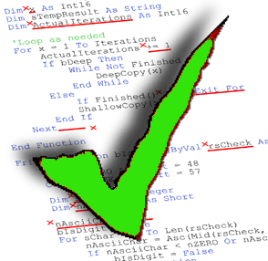

<!--  -->

<small>
Authors:
Jianele Liu, Marques Batoon, Reyn Seki, Ryder Shintaku
</small>

## Overview 

Finding a toilet on campus that has a good clean to closeness ratio is always a lone struggle we studdents face each semester. We'd like to make this journey more collaborative by creating a web app social media where students are able to find nearest bathrooms to their location. 

The app will also allow students to rate a bathroom's cleanliness level and include things that others can be weary of. For example, the quality of soap in the bathroom, number of stalls, business at times of days, or if there are areas designated for users to place their belongings while using the premises.

## Mockup page ideas

## Use case ideas

## Beyond the basics
