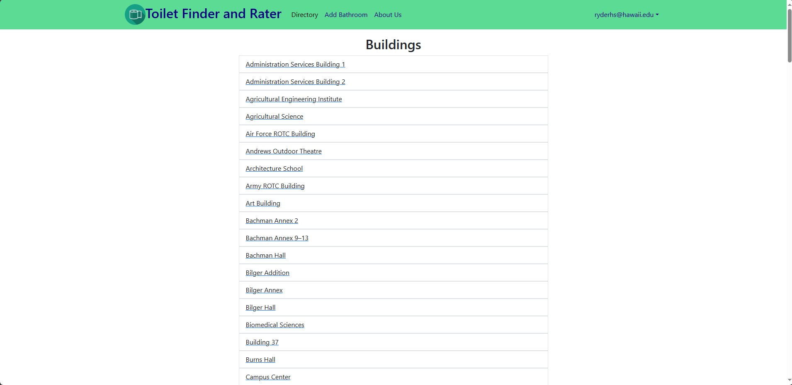

<div class="text-center p-4">
  <!--  -->
  
</div>

For our final project for ICS 314 we created a Full Stack application for UH Manoa students to find and rate bathrooms on UH campus.

After registering and signing in, users are able to gain access to the homepage where users learn about the use of the website, the bathroom directory where a user can find the highest rating bathrooms near their location by choosing a UH Manoa buildling within the directory. Bathroom directories will be organized by building and floor number. If a building or bathroom is not on the directory, users are able to add their own to the database with a submission form which automatically updates database on the Add Bathroom Page.

In the beginning of the project I took charge in leading our team in the direction of our application and assigning duties to everyone and ensuring everything was created with our combined vision. I initiated and created the initial file to work off of as well as our GitHub documentation page and our team page. In preparation for Milestone 2 I led a meeting in person to work on the development of our application. I made sure us back-end and front-end were on the same page and that meeting led to the most time-efficient day of our application. I worked with backend in creating the database and worked with front-end in how to change and modernize our app. During milestone 3 due to personal issues I took a backstep to the project but my team were excellent and I'm so grateful they were able to finish the app with my minimal help during these last few weeks.

I learned of the importance in pulling your weight in group projects as well as recognizing when someone can do more and when someone has done more than their share and deserve a break.

See the documentation [here](https://toilet-titans.github.io/).

Below is a sample of the first react components coded to pull data from the database.

```js
import React, { useState, useEffect } from 'react';
import { Container, Row, Col, ListGroup, ListGroupItem } from 'react-bootstrap';
import { Link } from 'react-router-dom';
import fetchData from '../../api/query/fetch';

const Directory = () => {
  const [buildings, setBuildings] = useState([]);
  const [loading, setLoading] = useState(true);

  useEffect(() => {
    const fetchBuildings = async () => {
      try {
        const buildingsData = await fetchData('getBuildings');
        setBuildings(buildingsData);
      } catch (error) {
        // Handle error if needed
      } finally {
        setLoading(false);
      }
    };
    fetchBuildings();
  }, []); // Empty dependency array ensures the effect runs once after the initial render

  return (
    <Container className="py-3" id="directory-page">
      <Row className="justify-content-center">
        <Col md={7}>
          <Col className="text-center">
            <h2>Buildings</h2>
          </Col>
          {loading ? (
            <div>Loading...</div> // Or any other loading indicator
          ) : (
            <ListGroup>
              {buildings.map((building) => (
                <Link to={`/gender/${building._id}/${encodeURIComponent(building.name)}`} key={building._id}>
                  <ListGroupItem>{building.name}</ListGroupItem>
                </Link>
              ))}
            </ListGroup>
          )}
        </Col>
      </Row>
    </Container>
  );
};

export default Directory;

```
<div class="text-center p-4">
  <!--  -->
  
</div>
