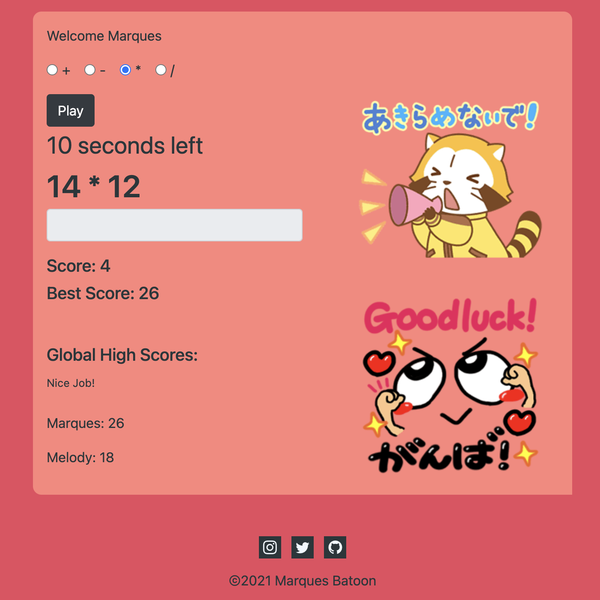
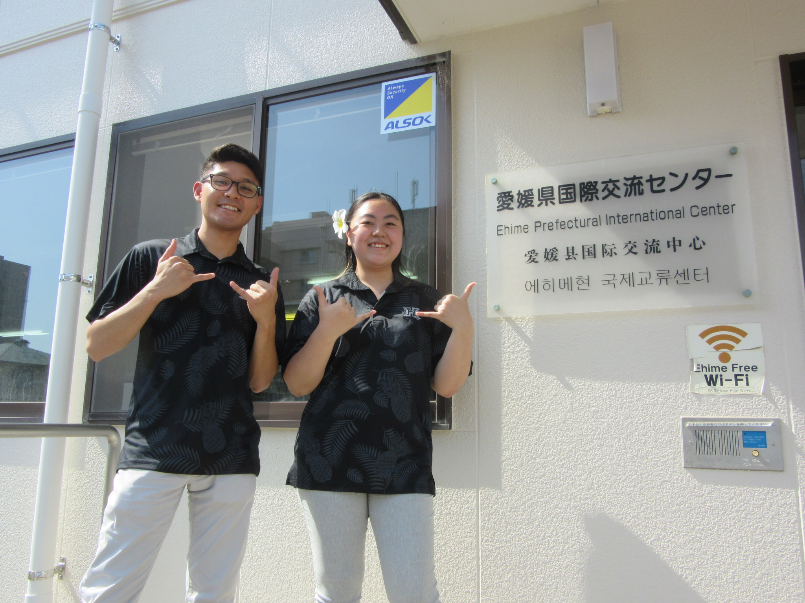
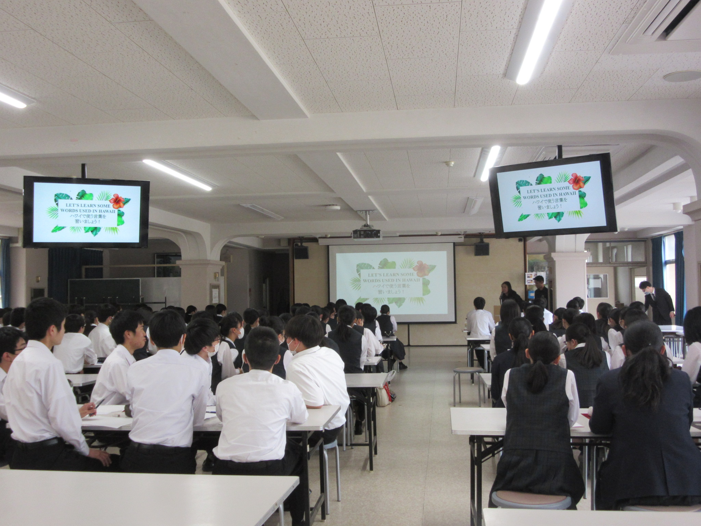

  <!--  -->
  

I was accepted as a summer intern to work at the Ehime Prefectural International Center in Ehime, Japan for three months. During the three months as an intern one of the tasks I was given was to host and present lectures and speeches in Japanese at several high schools, universities, events, and community centers.

  

On middle and high school visits my partner, Melody, and I would typically keep the topics generally simple such as introucing Hawaiian words and our recommended locations to visit. The Japanese students were always very energetic.

  

I also used an open source chartJS to help display the stats of each Pokémon. I tried to challenge myself and gave myself a time limit to see how far I could get creating this in one night.

See the web application here: [Link](https://marques-pokedex.netlify.app/)

