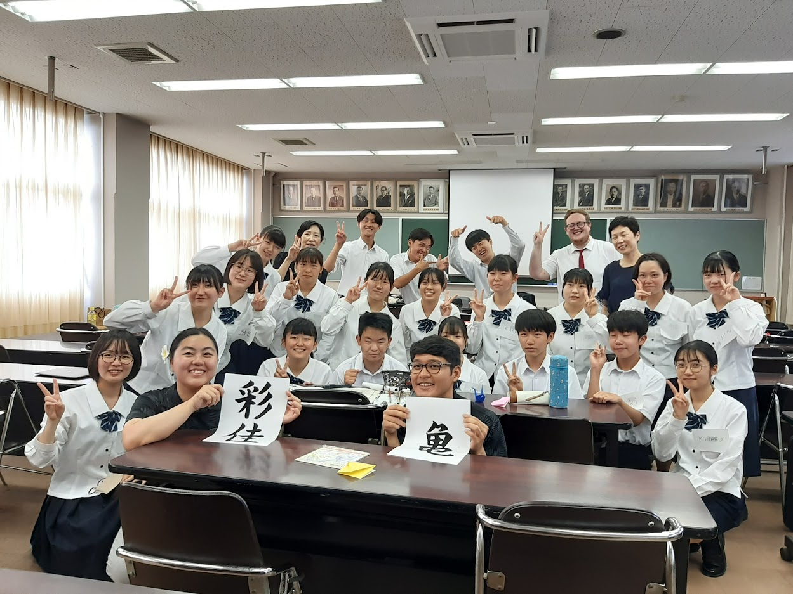
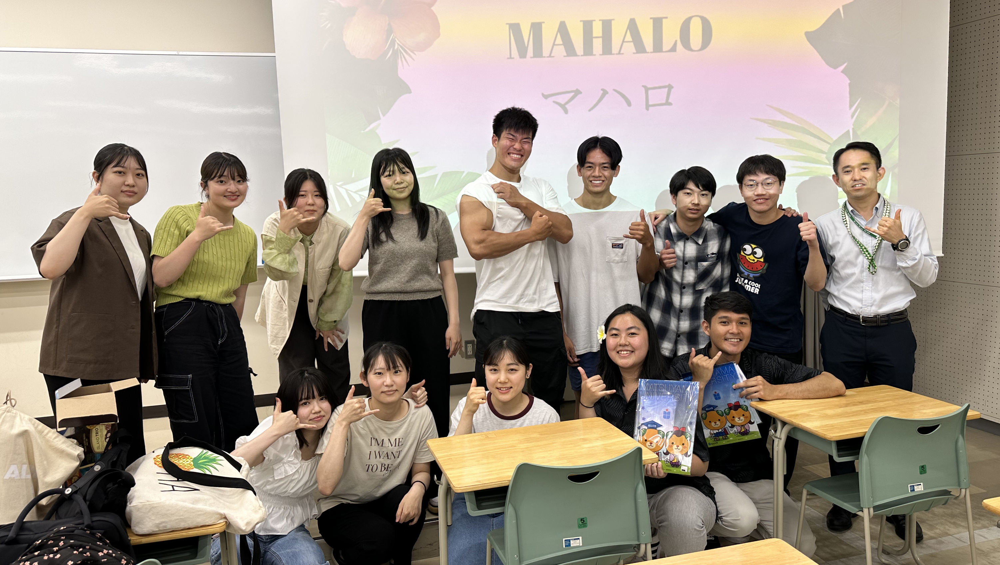

  

I was accepted as a summer intern to work at the Ehime Prefectural International Center in Ehime, Japan for three months. During my three months working in Japan, one of the tasks I was given was to plan, host and present many lectures and speeches in Japanese at several high schools, universities, events, and community centers.

  

On middle and high school visits my partner, Melody, and I would typically keep the topics generally simple such as introucing Hawaiian words and our recommended locations in Hawaii to visit. The earnest Japanese students were always very energetic.

  

On visits to universities or community centers our topics were more challenging to match the audience. Several topics we talked about were Hawaii's history and relations with Japan and sister cities/states, environmental issues in Hawaii, and food history. We also helped introduce a special festival that celebrated the sister city relationship between Hawaii and Uwajima by giving a speech in Japanese welcoming and thanking everyone for inviting us to the wonderful event.

  
  

Some locations where we were asked to host events/lectures asked us to create a flyer as well. Below is an example of one of the flyers we created for these lectures:

  

