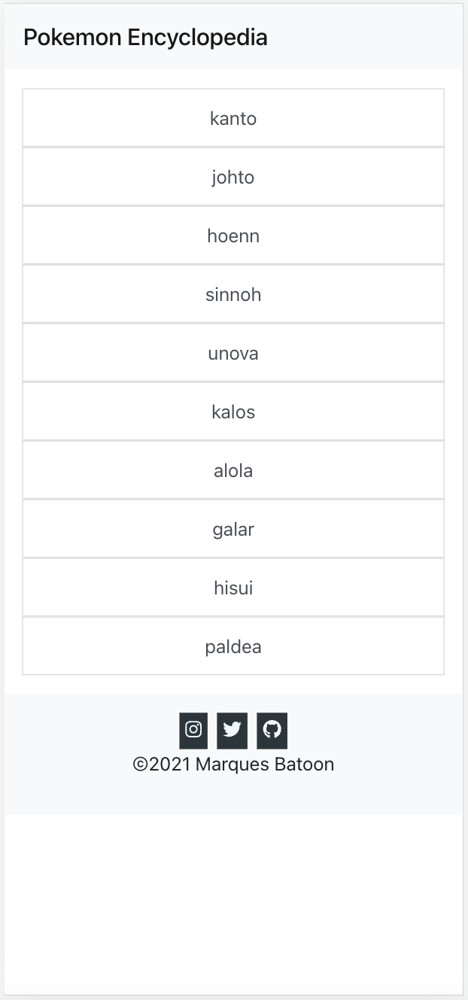
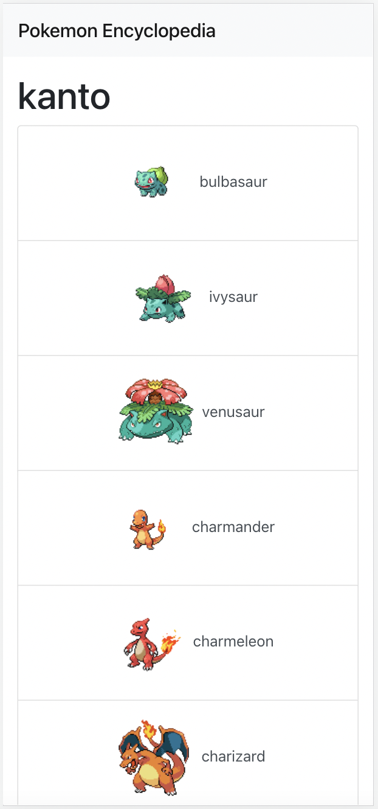
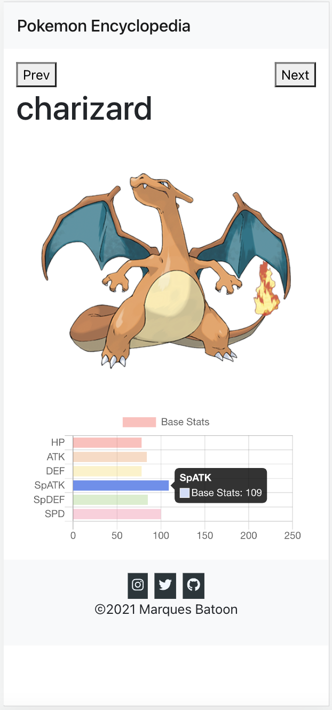

This is a simple web app that uses RESTful API for Pokémon data. Also uses open source JavaScript library chartJS. With the accumulated JavaScript and reactJS knowledge I've built up I wanted to make a personal project related to my past favorite video game, Pokémon. I found a [modern RESTful API](https://pokeapi.co/) that contains extensive Pokémon data. 

My favorite thing about this app is that it updates on its own as the RESTful API updates without me needing to touch the original base code. So, when a new region is updated in the Pokémon games this application updates as well, as long as the API is updated as well (The most recent RESTful API data may not be as accurate since it isn't officially pulled from Nintendo). 

I also used an open source chartJS to help display the stats of each Pokémon. I tried to challenge myself and gave myself a time limit to see how far I could get creating this in one night.

See the web application here: [Link](https://marques-pokedex.netlify.app/)

<div class="text-center p-4">
  <!--  -->
  
  
  
</div>

Below is the fetch request code that stores information from the API to be used with the open source chartJS

```js
getMon = () => {
        fetch(`https://pokeapi.co/api/v2/pokemon/${this.state.name}`)
        .then(checkStatus)
        .then(json)
        .then(data => {
            if(data.error) {
                throw new Error(data.error);
            }
            // artwork
            this.setState({ imgLink: data.sprites.other["official-artwork"]["front_default"] });

            // stats for chart
            this.buildChart(["HP", "ATK", "DEF", "SpATK", "SpDEF", "SPD"], [data.stats[0].base_stat, data.stats[1].base_stat, data.stats[2].base_stat, data.stats[3].base_stat, data.stats[4].base_stat, data.stats[5].base_stat], "Base Stats");

            // pokeNum
            const mon0 = data.species.url;
            const pokeNum = mon0.substring(mon0.lastIndexOf("species") + 8, mon0.lastIndexOf("/"));
            this.setState({ pokeNum });
            this.toNext(1 + parseInt(pokeNum));
            this.toPrev(parseInt(pokeNum) - 1);

        })
        .catch(error => console.log(error.message));
    }
```
